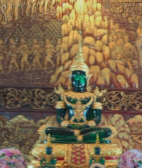

# 🅰️-Frame + Next frame Wat Bupparam

This is a [Next.js](https://nextjs.org/) project bootstrapped with [`create-next-app`](https://github.com/vercel/next.js/tree/canary/packages/create-next-app).

This is also the Next porting for [This](https://github.com/drapisarda/aframe-wat-bupparam) project


## Wat Bupparam

(From [Wikipedia](https://en.wikipedia.org/wiki/Wat_Buppharam,_Chiang_Mai))

Wat Buppharam (Thai: วัดบุพพาราม, pronounced [wát bùp.pʰāː.rāːm]) is a Buddhist temple in Chiang Mai, Thailand. Founded in 1497 by King Mueang Kaeo,[1] the temple was where Kawila began a ritual circumambulation of Chiang Mai to reoccupy it after two centuries of Burmese rule.[2] Most of the temple buildings date to the late 1800s.[2] The temple is also known for its Burmese-style chedi, which was rebuilt in 1958, and a Lanna-style ordination hall made from teak and glass inlay mosaic, built in 1819.[3]

## Interactions

The user can interact with these items by clicking them with the mouse cursor or the visor cursor




## Getting Started

A public accessible instance of the project can be found [here](https://aframe-next-wat-bupparam.vercel.app/).

### Run the project locally

Download the project and on a terminal window run:

```bash
npm i
# or
yarn
```

to install the needed dependencies.

Then run the development server with:

```bash
npm run dev
# or
yarn dev
# or
pnpm dev
# or
bun dev
```

The project will be run on [http://localhost:3000](http://localhost:3000) or the next available port.
